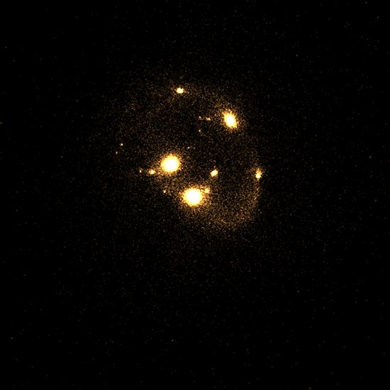

# GPU-GEMS-NBody-Simulation

This project is based on the GPU Gems article NBody simulation in CUDA. Although Unity does not support CUDA it does support Direct Compute which is the Microsoft equivalent. Nbody simulation is a popular technique used to simulate particle systems such as star/galaxy motion, fluids, electrical forces and many more physical systems.

In some simulations a Euler model is used, where space is subdivided into discrete elements that represent the amount of a certain property like density in anyone location. The Euler model is common in GPU programming because it maps very well to how the GPU works. This method is not without its issues however. It suffers from numerical errors and the simulation is confined to the domain where space is subdivided, usually represented by a texture or buffer.

For some things a more natural approach is to use a particle system. This is where NBody simulations come in. They are not domain bound, are less prone to numerical errors and use less memory. While the math is relatively simple compared to a Euler simulation the method used to get the algorithm to map to the GPU makes for a more complicated shader. The shader requires some of the more advanced Direct compute features such as shared memory and thread synchronization. This make NBody simulations a good place to start learning more about Direct Compute.

List of physics projects

[Position-Based-Dynamics](https://github.com/Scrawk/Position-Based-Dynamics)\
[PBD-Fluid-in-Unity](https://github.com/Scrawk/PBD-Fluid-in-Unity)\
[GPU-GEMS-NBody-Simulation](https://github.com/Scrawk/GPU-GEMS-NBody-Simulation)\
[GPU-GEMS-2D-Fluid-Simulation](https://github.com/Scrawk/GPU-GEMS-2D-Fluid-Simulation)\
[GPU-GEMS-3D-Fluid-Simulation](https://github.com/Scrawk/GPU-GEMS-3D-Fluid-Simulation)\
[CyclonePhysicsEngine](https://github.com/Scrawk/CyclonePhysicsEngine)\
[2D-Deformable-body-in-Unity](https://github.com/Scrawk/2D-Deformable-body-in-Unity)
